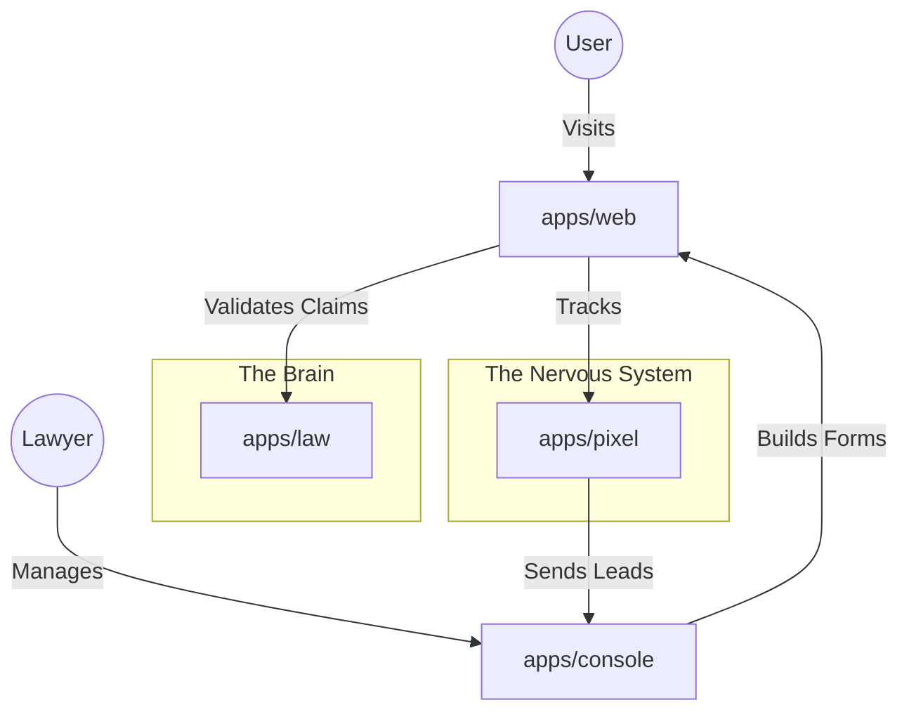

This `README.md` is the root-level entry point for the **MoreWays Ecosystem**. It provides the high-level architectural context, explaining how the four distinct applications (`console`, `law`, `pixel`, `web`) collaborate to form the complete AI-native legal platform.

---

# MoreWays Ecosystem

**The AI-Native Operating System for Legal Intake & Case Management.**

The **MoreWays Ecosystem** is a monorepo containing a suite of high-performance applications designed to automate the bridge between consumer legal issues and law firm operations. It moves beyond simple static forms by utilizing conversational AI, graph-based legal knowledge retrieval, and server-side attribution tracking.

## 🏛️ System Architecture

The ecosystem consists of four specialized applications that function as a distributed system:



## 📦 The Four Pillars

### 1. 🎛️ Console (`apps/console`)
**The Command Center.**
This is the internal CRM and Operations dashboard for legal teams.
*   **Form Architect:** An AI-powered builder where lawyers describe a case type, and the system generates a schema with complex logic.
*   **Inbox:** A workspace to review leads, view AI verdicts, and export legal memos.
*   **CRM:** Manages "Matters," clients, and tenant configurations.

### 2. ⚖️ Law (`apps/law`)
**The Magistrate.**
A dedicated legal intelligence engine that treats law as a hierarchical graph, not just text.
*   **Legal Graph:** Ingests PDFs (CFR, CMR, USC) and maintains parent/child relationships for precise context.
*   **The Judge:** An AI service that evaluates incoming claims against specific statutes to determine merit (`Likely Violation` vs `Unlikely`).
*   **Hybrid RAG:** Combines vector search with full-text search and recursive graph traversal.

### 3. 🎯 Pixel (`apps/pixel`)
**The Nervous System.**
A privacy-first, first-party data engine for attribution and identity resolution.
*   **Identity Graph:** Merges anonymous sessions with known user profiles (Email/Phone) using PII hashing.
*   **Server-Side Dispatch:** Sends conversion signals directly to Meta CAPI, Google Ads, and TikTok, bypassing browser blockers.
*   **Viral Tracking:** Detects word-of-mouth sharing chains.

### 4. 🌐 Web (`apps/web`)
**The Public Interface.**
The consumer-facing application that hosts marketing pages, the client portal, and the intake engine.
*   **Unified Runner:** A polymorphic engine that renders Console schemas as either chat-based conversations or standard forms.
*   **Intake Router:** Uses AI to triage a user's natural language problem and route them to the correct specific legal form.
*   **Client Portal:** A secure dashboard for clients to track the status of their claims.

---

## 🚀 Getting Started

### Prerequisites
*   **Node.js** v18+ (v20 Recommended)
*   **pnpm** (Required for workspace management)
*   **Docker** (For local DB and Redis services)
*   **PostgreSQL** & **Supabase** (Remote or Local)

### Installation

1.  **Clone the Monorepo:**
    ```bash
    git clone https://github.com/moreways-ecosystem/moreways.git
    cd moreways
    ```

2.  **Install Dependencies (Root):**
    This will install dependencies for all workspaces (`apps/*`).
    ```bash
    pnpm install
    ```

3.  **Environment Setup:**
    Each app requires its own `.env` file. See `.env.example` in each application directory.
    *   `apps/console/.env`
    *   `apps/law/.env`
    *   `apps/pixel/.env`
    *   `apps/web/.env`

### Development

You can run individual apps or the entire stack.

**Run a specific app:**
```bash
# Term 1: The Law Engine (Backend)
cd apps/law && pnpm dev

# Term 2: The Console (Admin)
cd apps/console && pnpm dev

# Term 3: The Public Site (Frontend)
cd apps/web && pnpm dev
```

**Database Migrations:**
Since the apps share some underlying data structures (via Supabase), migrations are handled per app scope.
```bash
# Example: Migrate the Pixel database
cd apps/pixel && pnpm db:migrate
```

---

## 🧬 Data Flow: "The Life of a Lead"

1.  **Arrival:** A user lands on `apps/web`. The `apps/pixel` script loads, fingerprinting the session and capturing ad parameters (GCLID).
2.  **Triage:** The user types "My car was sold with a bad transmission." The `apps/web` Chat Router asks `apps/console` for the "Lemon Law" schema.
3.  **Intake:** The Unified Runner executes the schema. As the user answers, `apps/law` (The Judge) runs in the background to validate if the car's mileage qualifies under state law.
4.  **Submission:** The user submits.
    *   **Data:** Saved to `apps/console` (CRM).
    *   **Identity:** `apps/pixel` resolves the user identity and fires a "Lead" event to Meta/Google.
    *   **Verdict:** `apps/law` saves a final legal opinion to the case file.
5.  **Review:** A lawyer opens `apps/console`, sees the "Likely Violation" badge, reads the AI-generated memo, and accepts the case.
6.  **Notification:** The client logs into `apps/web` (Portal) and sees their status updated to "Case Accepted."

## 🧪 Testing Strategy

We use a mix of **Vitest** (Unit/Integration) and **Playwright** (E2E).

*   **Unit Tests:** Located in `tests/unit` or alongside source files (`*.test.ts`). Run via `pnpm test`.
*   **E2E Tests:** Located in `tests/e2e`. These test the full flows, such as a user submitting a form on `web` and it appearing in `console`.

## 📄 License

Copyright © MoreWays Ecosystem. All Rights Reserved.
*Internal Use Only.*