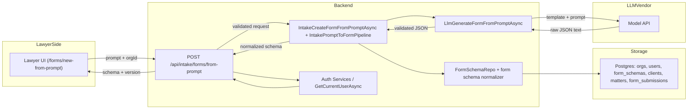
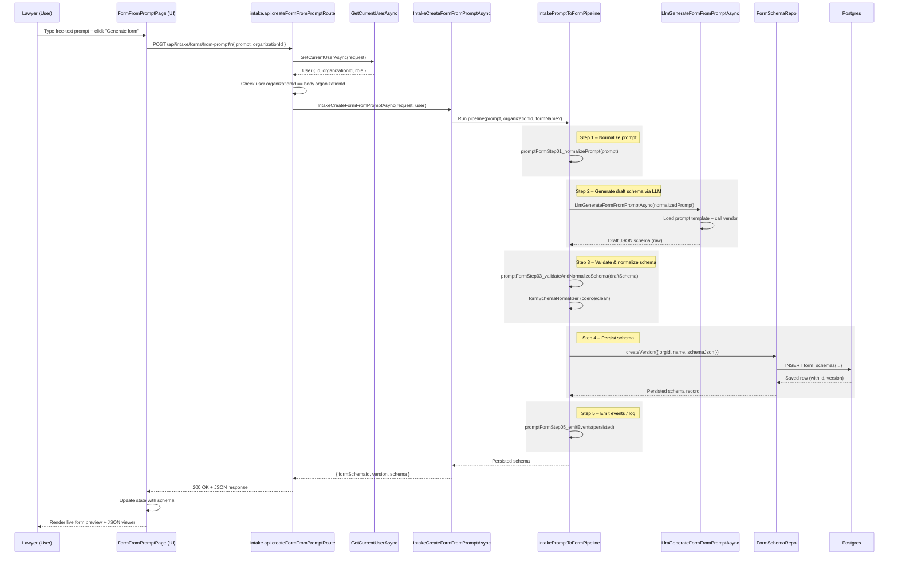
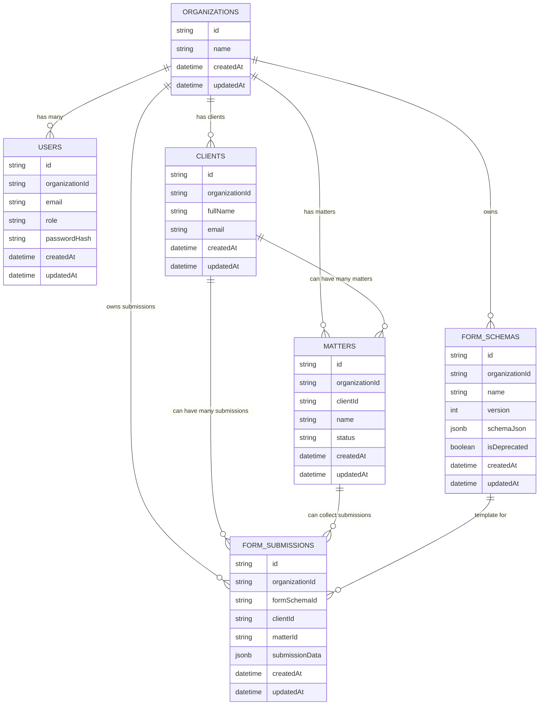
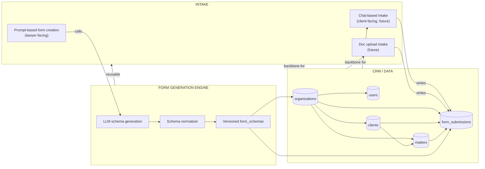
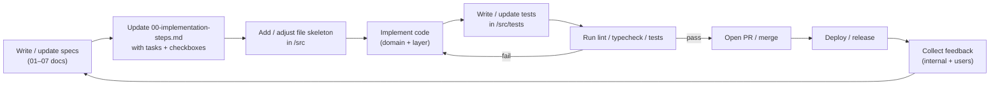
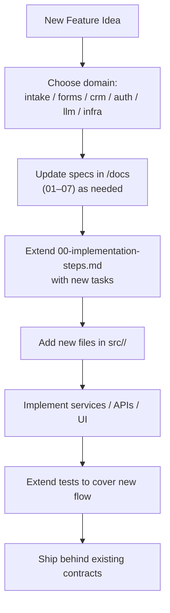

# argueOS Formgen – Diagrams & Workflows

This doc visualizes the core architecture and workflows for the v1 form generator:

- High-level system overview
- Prompt → Form Schema → DB → Preview flow
- CRM data model
- Feature relationships
- Development cycle

All diagrams are written in Mermaid so they can be rendered in GitHub or other viewers.

---

## 1. High-Level System Overview



---

## 2. Prompt → Form Schema → DB → Preview (Sequence)



---

## 3. CRM & Data Model (ER Diagram)



---

## 4. Feature Relationships (Intake, Formgen, CRM)



---

## 5. Development Cycle for Features (Spec → Ship)



---

## 6. Where New Features Plug In



---

```

