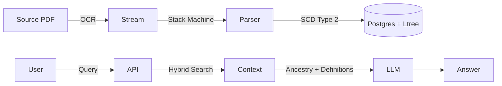

# 🏛️ Law Parsing Engine (LPE)

[](https://github.com/your-org/law-parsing-engine/actions)
[](https://opensource.org/licenses/MIT)
[](https://www.typescriptlang.org/)

> **A deterministic, high-integrity ingestion engine for converting unstructured legal regulations (PDF) into a queryable, hierarchical Knowledge Graph.**

---

## 🧐 The Problem
Traditional RAG (Retrieval Augmented Generation) fails in the legal domain because:
1.  **Context Blindness:** Vector search misses the relationship between a `Subsection (a)` and its parent `Section 3.00`.
2.  **Stochasticity:** Lawyers cannot rely on "probabilistic" retrieval. They need **provenance**.
3.  **Visual Structure:** Legal meaning is often encoded in indentation (whitespace), which OCR engines destroy.

## 💡 The Solution: LPE
LPE treats the law as a **Directed Acyclic Graph (DAG)**. It uses a **Stack Machine Parser** to reconstruct the strict hierarchy of regulations, ensuring that every retrieved node brings its full ancestral context and scoped definitions.

### Architecture



---

## ✨ Features

- **🛡️ Deterministic Parsing:** Uses coordinate-based indentation checks to verify Regex matches.
- **⏳ Time Travel (SCD Type 2):** Queries can target the law *as it existed* on a specific date.
- **🌳 Hierarchical Retrieval:** Uses PostgreSQL `ltree` to fetch "Vertical Slices" of law (Statute -> Section -> Paragraph).
- **🛑 Judicial Overrides:** A dedicated "Kill Switch" system to redact regulations enjoined by courts.
- **🔁 Resumable Ingestion:** Tracks job state in DB; automatically resumes after crashes.
- **🔒 Enterprise Security:** Role-based RLS (Row Level Security) and credential injection.

---

## 🛠️ Getting Started

### Prerequisites
- Node.js v20+
- Docker
- Supabase Project (or local Postgres with `pgvector` & `ltree`)
- OpenAI API Key

### 1. Installation
```bash
git clone https://github.com/your-org/law-parsing-engine.git
cd law-parsing-engine
npm install
```

### 2. Environment Setup
Copy the example config:
```bash
cp .env.example .env
```
Fill in your secrets:
```ini
SUPABASE_URL="https://your-project.supabase.co"
SUPABASE_KEY="your-service-role-key"
OPENAI_API_KEY="sk-..."
# For Google Drive Ingestion (Optional)
GOOGLE_CREDENTIALS_JSON='{"type": "service_account", ...}'
```

### 3. Database Migration
Run the initialization SQL scripts in your Supabase SQL Editor:
1. `scripts/init_db.sql` (Core Schema)
2. `scripts/init_job_tracker.sql` (Ingestion State)

### 4. Running the Engine
**Ingestion Worker:**
```bash
# Ingests from Google Drive defined in scripts/run-drive-ingest.ts
npm run start:ingest
```

**Testing:**
```bash
npm test          # Run all tests
npm run test:unit # Fast logic checks
```

---

## 🧪 The "Code Fortress" Testing Strategy

We employ a 4-tier testing strategy to ensure zero hallucinations.

| Tier | Scope | Command | Description |
| :--- | :--- | :--- | :--- |
| **1. Unit** | Logic | `npm run test:unit` | Regex profiles, sanitizers, cache logic. |
| **2. Golden Set** | Regression | `npm run test:golden` | Hashes parsed output of control PDFs to ensure 0 changes. |
| **3. Stress** | Scale | `npm run test:stress` | Memory leak detection (10k pages) and Concurrency (Race conditions). |
| **4. Integration** | E2E | `npm run test:int` | Full pipeline: PDF -> DB -> Vector Search -> LLM Context. |

---

## 📦 Deployment

### Docker
The image is optimized (~400MB) using `node:20-slim`.

```bash
docker build -t lpe:v1 .
docker run --env-file .env lpe:v1
```

### CI/CD
This repo includes a GitHub Actions workflow (`.github/workflows/fortress.yml`) that runs the Fuzzer, Linter, and Golden Set tests on every PR.

---

## 📜 License
MIT License. See [LICENSE](LICENSE) for details.
