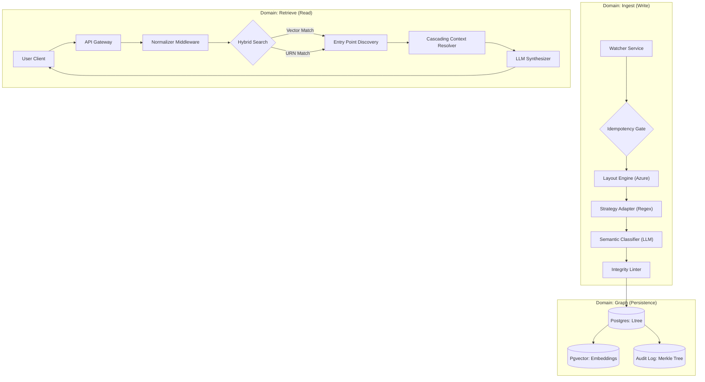

# 01 – System Topology & Service Boundaries

**Status:** Ratified  
**Version:** 1.0  
**Context:** Infrastructure

## 1. High-Level Architecture
The system operates as an asynchronous, event-driven pipeline separated into three distinct domains: **Ingestion (Write)**, **Persistence (Store)**, and **Resolution (Read)**.

## 2. Service Boundaries

### 2.1 The Ingestion Worker (Node.js)
*   **Role:** Stateless processing unit.
*   **Responsibility:** Converts raw PDF bytes into a validated JSON Tree.
*   **Constraints:** Must be idempotent. Re-running the worker on the same file results in zero side effects (content-addressable hashing).

### 2.2 The Persistence Layer (PostgreSQL/Supabase)
*   **Role:** The Source of Truth.
*   **Responsibility:** Enforces hierarchy (`ltree`), validity (`daterange`), and uniqueness (`URN`).
*   **Constraints:** No "Soft Deletes." Changes are handled via versioning new rows. The DB enforces the graph topology.

### 2.3 The Resolution API (Edge Functions)
*   **Role:** The query interface.
*   **Responsibility:** Reconstructs the "Legal Reality" for a specific URN at a specific point in time.
*   **Constraints:** Read-only access to the Graph. Never writes.
